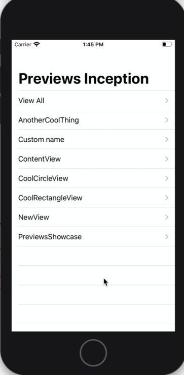

# SwiftUI Preview Previews Inception

***Automatically generate a list of all Swift ui views that contain previews.***

Sometimes looking at the previews on a case by case basis is not enough. 

As you add new previews to your project `PreviewShowcaseListView` will essentially show them all so it can be previewed directly in Xcode or loaded into the simulator.

Another use case would be to show designers, specially if you are tyring to build a design system.

Behind the scenes it uses Sourcery https://github.com/krzysztofzablocki/Sourcery to autogenerate comformance to `Previewable`

